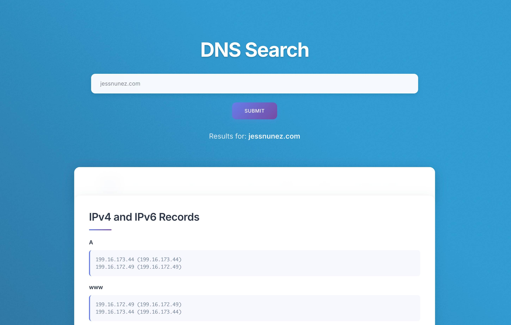

# DNS Search Tool 🔍

A modern, clean, and comprehensive DNS lookup tool built with PHP that provides detailed information about any domain or IP address. Features a beautiful glassmorphic design with smooth animations and responsive layout.



## ✨ Features

### 🌐 **Comprehensive DNS Records**
- **A Records** - IPv4 address mapping
- **AAAA Records** - IPv6 address mapping  
- **MX Records** - Mail exchange servers
- **NS Records** - Name servers
- **SOA Records** - Start of Authority
- **TXT Records** - Text records (SPF, DKIM, etc.)
- **SRV Records** - Service records
- **CNAME Records** - Canonical name records

### 🔎 **Additional Lookup Features**
- **WHOIS Information** - Domain and IP registration details
- **Blacklist Checking** - Integration with MXToolbox for spam blacklist verification
- **WWW Subdomain** - Separate lookup for www subdomain
- **IP Address Support** - Works with both domains and IP addresses

### 🎨 **Modern UI/UX**
- **Glassmorphic Design** - Modern translucent card-based interface
- **Smooth Animations** - Subtle hover effects and transitions
- **Responsive Layout** - Works perfectly on desktop, tablet, and mobile
- **Clean Typography** - Easy-to-read results with monospace code blocks
- **Intuitive Navigation** - Quick access to different record types

## 🚀 Getting Started

### Prerequisites
- PHP 7.0 or higher
- Web server (Apache, Nginx, etc.)
- DNS functions enabled in PHP

### Installation

1. **Clone the repository**
   ```bash
   git clone https://github.com/wpjess/dns-search.git
   cd dns-search
   ```

2. **Upload to your web server**
   - Upload all files to your web server's document root
   - Ensure PHP has permission to execute DNS lookup functions

3. **Configure your web server**
   - Point your domain to the directory containing `index.php`
   - Ensure `.htaccess` rules are processed (if using Apache)

4. **Access the tool**
   - Navigate to your domain in a web browser
   - Start looking up DNS records!

## 🛠️ Usage

### Basic Domain Lookup
1. Enter a domain name (e.g., `google.com`) in the search field
2. Click "Submit" or press Enter
3. Browse through different DNS record types using the navigation menu
4. View detailed results for each record type

### Supported Input Formats
- `example.com`
- `www.example.com`
- `https://example.com`
- `192.168.1.1` (IP addresses)

### Navigation
After performing a search, use the navigation bar to quickly jump between:
- **A** - IPv4 and IPv6 records
- **MX** - Mail server information
- **NS** - Name server details
- **SOA** - Authority information
- **TXT** - Text records
- **SRV** - Service records
- **CNAME** - Alias records
- **WHOIS** - Registration information
- **Blacklist Check** - External spam database verification

## 📁 File Structure

```
dns-search/
├── index.php              # Main application file
├── style.css             # Modern CSS styles
├── functions/
│   ├── domain.php        # DNS lookup functions
│   └── whois.php        # WHOIS lookup functions
├── js/                   # JavaScript files for UI
│   ├── jquery.min.js
│   ├── main.js
│   └── ...
├── images/
│   ├── screenshot1.jpg   # Tool screenshot
│   ├── favicon.ico      # Site favicon
│   └── overlay.png      # Background overlay
└── README.md            # This file
```

## ⚙️ Technical Details

### DNS Record Functions
The tool includes custom PHP functions for each DNS record type:
- `ARecord()` - A record lookup
- `AAAARecord()` - AAAA record lookup
- `MXRecord()` - MX record lookup
- `NSRecord()` - NS record lookup
- `SOARecord()` - SOA record lookup
- `TXTRecord()` - TXT record lookup
- `SRVRecord()` - SRV record lookup
- `CNAMERecord()` - CNAME record lookup

### Input Processing
- Automatically strips protocols (`http://`, `https://`)
- Removes `www.` prefix for consistent results
- Validates domain names and IP addresses
- Handles both GET and POST requests

### Security Features
- Input validation and sanitization
- Error reporting for debugging
- Secure DNS query execution

## 🎨 Customization

### Styling
The tool uses modern CSS with:
- CSS Grid and Flexbox layouts
- CSS custom properties (variables)
- Smooth transitions and animations
- Mobile-first responsive design

### Color Scheme
Default gradient: Purple-blue (`#667eea` to `#764ba2`)
- Easily customizable in the CSS file
- Glassmorphic elements with backdrop blur
- High contrast for accessibility

## 🤝 Contributing

1. Fork the repository
2. Create a feature branch (`git checkout -b feature/amazing-feature`)
3. Commit your changes (`git commit -m 'Add amazing feature'`)
4. Push to the branch (`git push origin feature/amazing-feature`)
5. Open a Pull Request

## 📝 License

This project is open source and available under the [MIT License](LICENSE).

## 🐛 Issues & Support

If you encounter any issues or have suggestions for improvements:
1. Check the [Issues](https://github.com/wpjess/dns-search/issues) page
2. Create a new issue with detailed information
3. Include steps to reproduce any bugs

## 🔗 Links

- **GitHub Repository**: [wpjess/dns-search](https://github.com/wpjess/dns-search)
- **Live Demo**: [DNS Search Tool](https://jessnunez.com/dns/)
- **MXToolbox Integration**: External blacklist checking
- **PHP DNS Functions**: Built on native PHP DNS functions

---

**Made with ❤️ by Jess** - A modern take on DNS lookup tools
